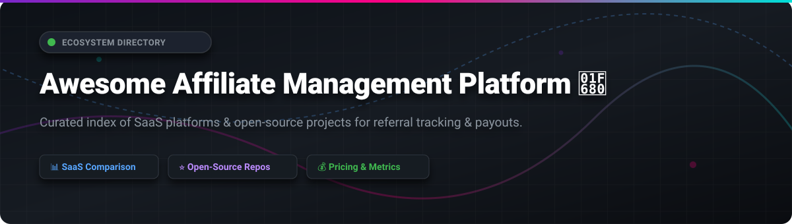

# Awesome Affiliate Management Platform 🚀

  

> **Curated List of SaaS Products & Open-Source GitHub Projects for Affiliate Tracking, Partner Management, Referral Software, and Performance Marketing Automation** 📈

---

## 📌 Ecosystem Overview & Market Insights

> 💡 **Market Size & Structure**: The global affiliate marketing software market is estimated at **$17 Billion to $22 Billion** (as of 2026), projecting a ~10% CAGR. The sector is **moderately fragmented**—with a few large enterprise leaders (e.g., Impact.com, PartnerStack) occupying high market caps, alongside a flourishing ecosystem of specialized subscription/SaaS tools (Rewardful, Tapfiliate) and self-hosted open-source software.

---

## 📋 Table of Contents
- [SaaS & Hosted Platforms 💼](#saas--hosted-platforms-)
- [Open-Source GitHub Repositories 💻](#open-source-github-repositories-)
- [Key Features to Consider 🔍](#key-features-to-consider-)
- [How to Contribute 🤝](#how-to-contribute-)
- [Support & Sponsorship 💖](#support--sponsorship-)
- [Disclaimer ⚠️](#disclaimer-)
- [Star History 📈](#-star-history)

---

## 💼 SaaS & Hosted Platforms

Below is a detailed comparison of leading commercial affiliate tracking and partner ecosystem management platforms, sorted by **estimated company scale (Revenue / Valuation)** in descending order.

| Platform 🏢 | Enterprise Scale / Market Size 📊 | Starting Price 💵 | Free Tier / Free Trial Limits 🎁 | Primary Features & Best For 🎯 |
| :--- | :--- | :--- | :--- | :--- |
| **[Impact.com](https://impact.com/)** 🚀 | **Valuation: ~$1.5 Billion** ARR: ~$270 Million | **$30 / month** (Starter Tier) | 30-Day minimum fee waiver for starter programs; Free for partner accounts | Enterprise partnership automation, multi-touch attribution, influencer tracking, and global payout compliance. |
| **[PartnerStack](https://partnerstack.com/)** 🤝 | **ARR: ~$50+ Million** Network: >$100M payout | **$500 / month** (Custom growth quote) | "Spark" tier free for basic referral programs; Demo-arranged pilot period | Built for B2B SaaS partner ecosystems, offering an active marketplace of 800k+ B2B promoters. |
| **[Everflow](https://www.everflow.io/)** ⚡ | **Estimated ARR: ~$25M–$30M** (Acquired by Pegasystems) | **$750 / month** | No public free trial; Demo & pilot setup upon revenue qualification | High-throughput performance tracking, fraud controls, and multi-tier network attribution. |
| **[Tapfiliate](https://tapfiliate.com/)** 🎯 | **Estimated ARR: ~$2M–$5M** (Acquired by Admitad) | **$89 / month** (Launch Plan) | **14-Day Free Trial** (Includes 50 affiliates, 5k clicks, 500 conversions) | Turnkey affiliate tracking for e-commerce (Shopify, WooCommerce) and SaaS subscription models. |
| **[Post Affiliate Pro](https://www.postaffiliatepro.com/)** 🛠️ | **Estimated ARR: ~$1.5M–$3M** (Quality Unit) | **$129 / month** (Pro Plan) | **30-Day Free Trial** (Full access, no credit card required) | Extremely flexible commission structures, recurring payouts, and white-label affiliate portals. |
| **[Rewardful](https://www.rewardful.com/)** 💳 | **Estimated ARR: ~$1M–$2M** | **$49 / month** (Starter Plan) | **14-Day Free Trial** (Covers up to $7,500/mo in affiliate revenue) | Deep Stripe & Paddle integration for SaaS subscription affiliate and referral programs. |

---

## 💻 Open-Source GitHub Repositories

Self-hosted and open-source affiliate management software gives startups and developers complete data ownership and zero commission overhead. The table below lists active repositories, sorted by **GitHub_Stars** in descending order.

| Repository & Link 🐙 | Popularity ⭐️ | Tech Stack & Framework 🛠️ | Description & Use Case 📝 |
| :--- | :---: | :--- | :--- |
| **[WeferralHq/weferral](https://github.com/WeferralHq/weferral)** 🚀 |  | Node.js, React, Docker | Complete referral management and affiliate tracking software for high-velocity SaaS growth. |
| **[Refferq/Refferq](https://github.com/Refferq/Refferq)** ✨ |  | Next.js, Prisma, PostgreSQL | Modern self-hosted affiliate & referral marketing platform with admin portal and flexible commission rules. |
| **[Affitor/open-affiliate](https://github.com/Affitor/open-affiliate)** 🤖 |  | TypeScript, Node.js | Open registry and SDKs for AI agents and developers to integrate automated affiliate workflows. |
| **[jijunair/laravel-referral](https://github.com/jijunair/laravel-referral)** 🐘 |  | PHP, Laravel | Expressive Laravel package to equip applications with referral tracking and link generation. |
| **[padosoft/laravel-affiliate-network](https://github.com/padosoft/laravel-affiliate-network)** 🌐 |  | PHP, Laravel API Wrappers | Common interface for communicating with multiple affiliate network APIs (CJ, Zanox, etc.). |
| **[intelliants/elitius](https://github.com/intelliants/elitius)** 📜 |  | PHP, MySQL | Classic open-source affiliate tracking script for webmasters. |
| **[dfg-ar/numok](https://github.com/dfg-ar/numok)** ⚡ |  | TypeScript, Stripe API | Stripe-native self-hosted affiliate system that calculates commissions automatically via webhooks. |
| **[soldatov-ss/django-referral-system](https://github.com/soldatov-ss/django-referral-system)** 🐍 |  | Python, Django | Full-featured referral program app providing referral codes, commission distribution, and click analytics. |
| **[ZAK123DSFDF/refearnapp](https://github.com/ZAK123DSFDF/refearnapp)** ☁️ |  | Next.js, Cloudflare Workers | Edge-computed referral and affiliate conversion engine built for extreme scale. |
| **[prathammahajan13/affiliate-management-system](https://github.com/prathammahajan13/affiliate-management-system)** 🛠️ |  | Node.js, Express, MongoDB | Modular affiliate software supporting multi-tier commission structures and payout workflows. |
| **[org-quicko/cliq](https://github.com/org-quicko/cliq)** 🎨 |  | NestJS, Angular | Lightweight self-hosted affiliate tracker tailored for startup promoter management. |

---

## 🔍 Key Features to Consider

When evaluating **affiliate management software** or **referral marketing platforms**, ensure your chosen tool covers the following core requirements:

1. **Attribution & Cookie Windows** 🍪: Support for first-party cookies, server-to-server (S2S) postbacks, dynamic parameters, and custom attribution windows.
2. **Payment & Tax Automation** 💵: Automated payouts via PayPal, Stripe Connect, Wise, or direct bank transfer, paired with automatic tax document collection (W-9 / W-8BEN).
3. **Fraud Detection & Prevention** 🛡️: Click-fraud filtering, self-referral blocks, duplicate IP detection, and suspicious activity flagging.
4. **Partner Portal Experience** 🖥️: Clean dashboard for promoters to view referral links, track conversion rates, access marketing assets, and request payouts.
5. **Subscription & Recurring Commissions** 🔁: Built-in support for recurring SaaS subscription payouts and lifetime customer attribution.

---

## 🤝 How to Contribute

Contributions are welcome! Help us maintain the definitive guide to affiliate and referral management platforms.

1. **Fork** this repository.
2. Add your SaaS product or open-source repo in **alphabetical or sorted order**.
3. Follow the markdown table structure, providing factual pricing, scale metrics, or Stars_Counts.
4. Open a **Pull Request** detailing your changes.

---

## 💖 Support & Sponsorship

Thank you for visiting this repository! If you find this curated ecosystem list helpful for your marketing or development workflows, please consider supporting the project:

- ⭐ **Star this repository** to help others discover it.
- 🍴 **Fork & Share** with your fellow growth marketers and SaaS founders.
- ☕ **Buy a Coffee / Sponsor**: Support ongoing maintenance via the [GitHub Sponsor Dashboard](https://github.com/sponsors/ishandutta2007).

---

## ⚠️ Disclaimer

- This list is **community-curated** for research and evaluation purposes.
- Market capitalization, revenue estimates, and pricing tiers reflect data collected as of late 2026.
- Always review privacy regulations (GDPR, CCPA) and FTC disclosure guidelines when running affiliate and referral networks.

---

## 📈 Star History

